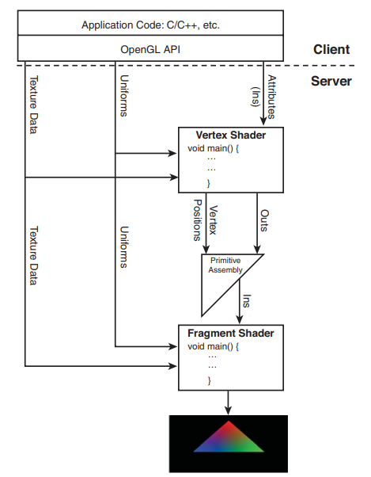

# The Rendering Pipeline

- [The Rendering Pipeline](#the-rendering-pipeline)
  - [Terminology](#terminology)
    - [Transformations](#transformations)
    - [Projections](#projections)
    - [Orthographic Projections](#orthographic-projections)
    - [Perspective Projections](#perspective-projections)
    - [Vertex](#vertex)
    - [Mesh](#mesh)
    - [Rasterization](#rasterization)
    - [Shading](#shading)
    - [Lighting](#lighting)
    - [Texture Mapping](#texture-mapping)
    - [Blending](#blending)
    - [Clipping](#clipping)
    - [Viewport](#viewport)
    - [Culling](#culling)
    - [Normalized Device Coordinates (NDC)](#normalized-device-coordinates-ndc)
    - [Depth Testing](#depth-testing)
    - [Framebuffer](#framebuffer)
    - [Double Buffering](#double-buffering)
    - [VSync](#vsync)
    - [Anti-Aliasing](#anti-aliasing)
    - [Real-Time Rendering](#real-time-rendering)
    - [Offline Rendering](#offline-rendering)
  - [The OpenGL Basic Rendering Pipeline](#the-opengl-basic-rendering-pipeline)
    - [Shaders](#shaders)
    - [Attributes](#attributes)
    - [Uniforms](#uniforms)

3D rendering is the process of taking the source 3D world and converting it into a 2D image that represents a view of that world from a particular angle.

An image consists of a grid of pixels. Each pixel has a color. The process of rendering is basically determining the color of each pixel in the image.

## Terminology

### Transformations

Transformation is the process of changing the position, orientation, or size of an object. In 3D rendering, transformations are represented as 4x4 matrices or as 3x3 matrices.

### Projections

Projection is the process of converting 3D coordinates into 2D coordinates. In 3D rendering, projections are represented as 4x4 matrices.

### Orthographic Projections

You are mostly concerned with two main types of projections in OpenGL. The first is called an orthographic, or parallel, projection. You use this projection by specifying a square or rectangular viewing volume. Anything outside this volume is not drawn. Furthermore, all objects that have the same dimensions appear the same size, regardless of whether they are far away or nearby. This type of projection is most often used in architectural design, computer-aided design (CAD), or 2D graphs. Frequently, you also use an orthographic projection to add text or 2D overlays on top of your 3D graphic scenes.

### Perspective Projections

The second and more common projection is the perspective projection. This projection adds the effect that distant objects appear smaller than nearby objects. The viewing volume is something like a pyramid with the top shaved off. The remaining shape is called **the frustum**. Objects nearer to the front of the viewing volume appear close to their original size, but objects near the back of the volume shrink as they are projected to the front of the volume. This type of projection gives the most realism for simulation and 3D animation.

### Vertex

Vertices (plural) can contain arbitrary of data, but among that data is a 3-dimensional position representing the location of the vertex in 3D space.

### Mesh

A mesh is a collection of vertices and indices that define a 3D object.

### Rasterization

A particular rendering method, used to convert a series of 3D triangles into a 2D image. The process of rasterization is performed by the GPU. The GPU takes the vertices of the triangles and converts them into pixels on the screen.

### Shading

Performing the actual rendering of the triangles. There are two types of shaders: vertex shaders and fragment shaders. A vertex shader might be used to transform the vertices of a mesh, and a fragment shader might be used to determine the color of each pixel in the mesh.

### Lighting

Lighting is the process of determining the color of a pixel based on the light sources in the scene. There are many different lighting models, but the most common is the Phong lighting model.

### Texture Mapping

Texture mapping is the process of applying a 2D image to the surface of a 3D object. The 2D image is called a texture. The process of texture mapping is performed by the GPU. Textures add a whole new level of realism to our rendering.

### Blending

Blending is the process of combining the color of a pixel with the color of the pixel that is already on the screen. Blending is used to render transparent objects, or create reflection effects.

### Clipping

Clipping is the process of removing triangles that are outside of the viewport. This is done by the GPU.

### Viewport

The viewport is the area of the screen that is used for rendering, and is the region within the window’s client area that is used for drawing the clipping area. Usually, the viewport is defined as the entire window, but this is not strictly necessary; for instance, you might want to draw only in the lower half of the window. It is specified in normalized device coordinates. The viewport is also called the screen space.

### Culling

Culling is the process of removing triangles that are facing away from the camera. This is done by the GPU.

### Normalized Device Coordinates (NDC)

Normalized device coordinates are the coordinates of the viewport. The viewport is specified in normalized device coordinates. The viewport is also called the screen space. These coordinates range from -1 to 1.

### Depth Testing

Depth testing is the process of determining whether a pixel should be drawn based on its distance from the camera. This is used to render objects in the correct order, so that objects that are closer to the camera are drawn on top of objects that are further away.

### Framebuffer

The framebuffer is a buffer that contains the color of each pixel on the screen. The framebuffer is stored in the GPU's memory. The framebuffer is also called the backbuffer.

### Double Buffering

Double buffering is the process of using two framebuffers. One framebuffer is used for rendering, and the other framebuffer is used for display. When rendering is complete, the two framebuffers are swapped. This prevents the user from seeing partially rendered frames.

### VSync

VSync is a feature that synchronizes the rendering of frames with the refresh rate of the monitor. This prevents the user from seeing partially rendered frames.

### Anti-Aliasing

Anti-aliasing is the process of reducing the jagged edges of a rendered image. This is done by blending the colors of adjacent pixels.

### Real-Time Rendering

Real-time 3D graphics are animated and interactive with the user. One of the earliest uses for real-time 3D graphics was in military flight simulators. Today, real-time 3D graphics are used in video games, virtual reality, and augmented reality.

### Offline Rendering

Offline 3D graphics are not animated or interactive with the user. They are used to create images and videos for movies, television, and advertising.

## The OpenGL Basic Rendering Pipeline

The basic rendering pipeline consists of the following steps:

The pipeline is divided into two halves: the application side (client) and the GPU side (server). The application side is the part of the pipeline that runs on the CPU. The GPU side is the part of the pipeline that runs on the GPU.

### Shaders

Shaders are programs that run on the GPU. There are two types of shaders: vertex shaders and fragment shaders. A vertex shader might be used to transform the vertices of a mesh, and a fragment shader might be used to determine the color of each pixel in the mesh.

The vertex shader processes incoming data from the client, applying transformations, or doing other types of math to calculate lighting effects, displacement, color values, and so on. To render a triangle with three vertices, the vertex shader is executed three times, once for each vertex. On today’s hardware, there are multiple execution units running simultaneously, which means all three vertices are processed simultaneously. Graphics processors today are massively parallel computers. Don’t be fooled by clock speed when comparing them to CPUs. They are orders of magnitude faster at graphics operations.

Three vertices are now ready to be rasterized. The primitive assembly box in the above figure is meant to show that the three vertices are then put together and the triangle is rasterized, fragment by fragment. Each fragment is filled in by executing the fragment shader, which outputs the final color value you will see on-screen. Again, today’s hardware is massively parallel, and it is quite possible a hundred or more of these fragment programs could be executing simultaneously.

### Attributes

Attributes are variables that are passed from the client to the vertex shader. Attributes are used to pass per-vertex data, such as position, color, and texture coordinates. Attributes can be floating-point, integer, or boolean data, and attributes are always stored internally as a four component vector, even if you don’t use all four components.

Attributes can have any meaning you want in the vertex program; you are in control.

Attributes are copied from a pointer to local client memory to a buffer that is stored (most likely) on the graphics hardware. Attributes are only processed by the vertex shader and have no meaning to the fragment shader.

Attributes are usually different for each vertex, but they can also be constant for all vertices. For example, the color of a triangle might be constant for all three vertices, but the position of each vertex is different.

### Uniforms

Uniforms are variables that are passed from the client to the vertex shader and fragment shader. Uniforms are used to pass data that is constant for all vertices or fragments, such as transformation matrices, lighting parameters, and texture samplers.

---

Next: [Getting Started](getting-started.md)